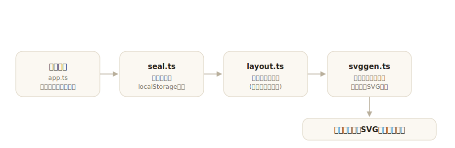

# hanko

[](https://github.com/miruky/hanko/actions/workflows/ci.yml)
[](https://github.com/miruky/hanko/actions/workflows/deploy.yml)

[](LICENSE)

**姓名や雅号を入れると、印影風のSVGをその場で組み上げるジェネレータ。**

公開ページ: https://miruky.github.io/hanko/

## 概要

hankoは文字から印鑑の印影に似たSVGを作る。主文(中央の文字)を入れ、丸印か角印、朱文か白文、字面と並べ方を選ぶと、印影がプレビューに現れてファイルとして保存できる。丸印では縁に沿う回文(社名や「代表者印」など)も付けられる。仕上げに、捺したときのような縁のかすれと地の斑(ムラ)を重ねられる。

主文は字数に応じて升目へ自動で割り付ける。たとえば四文字は右上・右下・左上・左下の順に置かれ、縦書きの読み順そのままに並ぶ。出来上がりはアバターやサイトの印、書類に重ねる電子印、落款のような署名として使える。

入力内容はブラウザのlocalStorageにだけ残り、サーバーへは何も送らない。

### なぜ作ったのか

印影風のロゴが要るとき、画像編集ソフトで円を描いて文字を置き、彫り抜きやかすれを手で作るのは手間がかかる。文字を入れれば朱文・白文の出し分けや縦書きの並びを引き受けてくれて、結果を構造の読めるSVGで出す道具がほしかった。SVGなのは、後から文字や色をテキストエディタで直せて、印刷にもWebにもそのまま渡せるからである。

### 篆書体について

本物の印鑑に使われる篆書体のような字形を出すには専用フォントが要る。hankoは字形そのものを作るのではなく、文字を表示環境のフォント(明朝かゴシック)で描き、円や角の縁・朱色・彫り抜き・かすれといった「印らしさ」を組み立てる。字面は閲覧環境に依存するため、保存したSVGを別の環境で開くと文字の見え方が変わる。確実に同じ字形で配りたい場合は、保存後にIllustratorやInkscapeでアウトライン化する。

## アーキテクチャ



入力の型と検証・保存(`seal.ts`)、升目への割り付け(`layout.ts`)、SVG生成(`svggen.ts`)、画面(`app.ts`)に分ける。割り付けとSVG生成はDOMを持たない純粋関数で、ブラウザなしでテストする。

## 技術スタック

| カテゴリ             | 技術                           |
| :------------------- | :----------------------------- |
| 言語                 | TypeScript 5(strict)           |
| ビルド               | Vite 6                         |
| テスト               | Vitest                         |
| リンタ・フォーマッタ | ESLint 9 / Prettier            |
| CI / 配信            | GitHub Actions / GitHub Pages  |
| 永続化               | localStorage(外部サービスなし) |

## 使い方

主文を入れると印影が即座に更新される。下の設定で見た目を決める。

| 設定     | 選択肢                              | 説明                                                       |
| :------- | :---------------------------------- | :--------------------------------------------------------- |
| 形       | 丸印 / 角印                         | 縁を円にするか角丸の矩形にするか                           |
| 彫り     | 朱文 / 白文                         | 文字を朱で残す(陽刻)か、地を朱で塗り文字を彫り抜く(陰刻)か |
| 字面     | 明朝 / ゴシック                     | 中央の文字に使うフォント                                   |
| 並べ方   | 自動 / 縦 / 横 / 格子               | 升目の並べ方。自動は字数で縦書きと格子を選ぶ               |
| 朱色     | 朱・真朱・古印・洗朱・墨・藍 / 自由 | 印の色                                                     |
| 縁の太さ | スライダ                            | 縁の線の太さ                                               |
| かすれ   | 切替                                | 捺したときの縁の欠けと地の斑                               |
| 紙地     | 切替                                | 透過の代わりに薄い紙色を背景に敷く                         |
| 回文     | 上弧 / 下弧                         | 丸印の縁に沿う文字(社名・「代表者印」など)                 |

「SVGを保存」でファイルに、「SVGをコピー」でSVGのコードをクリップボードに取り出せる。

### 主文の並び

主文は右の列から、列の中では上から下へ読む順に並ぶ。`自動`は字数で見やすい列数を選ぶ。

| 字数 | 自動での並び |
| :--- | :----------- |
| 1    | 中央に1字    |
| 2〜3 | 1列の縦書き  |
| 4    | 2×2の格子    |
| 5〜6 | 2列          |
| 7〜9 | 3列          |

### 配色テーマ

ヘッダ右のテーマボタンは「自動(OS設定に追従)・ライト・ダーク」を順に切り替え、選択は次回も保たれる。描画より前にテーマを解決するため再読み込みでもちらつかない。印影のプレビューは紙の質感を保つため、ダークでも明るい地のまま表示する。

### 制約

- 字形は表示環境のフォントに依存する。別環境で同一の見た目を保証したい場合はアウトライン化する。
- 主文は9字まで。これを超えると縁に収まらないため受け付けない。
- 回文は丸印のときだけ使える。長い回文は縁に文字が詰まるので、入る長さに収める。
- 本物の印鑑のような偽造防止性はない。実印・銀行印の代わりにはならない。

## プロジェクト構成

- `index.html` — エントリポイント
- `src/main.ts` — 起動。ストアの初期化
- `src/app.ts` — 設定フォームとプレビューの画面
- `src/icons.ts` — 線画SVGアイコン
- `src/style.css` — デザイントークンとスタイル(ライト・ダーク対応)
- `src/lib/seal.ts` — 印影の型・検証・永続化
- `src/lib/layout.ts` — 主文を升目へ割り付ける
- `src/lib/svggen.ts` — 印影SVGの生成
- `src/lib/theme.ts` — 配色テーマ(自動/ライト/ダーク)の解決と保存
- `docs/architecture.svg` — 構成図
- `.github/workflows/` — CI(lint・テスト・ビルド)とPagesデプロイ

## はじめ方

### 前提条件

- Node.js 22以上

### セットアップ

```bash
git clone https://github.com/miruky/hanko.git
cd hanko
npm install
npm run dev
```

### テストの実行

```bash
npm test
```

### Lintの実行

```bash
npm run lint
```

### ビルド

```bash
npm run build
```

GitHub Pagesではリポジトリ名のサブパスで配信されるため、デプロイ時は環境変数 `HANKO_BASE=/hanko/` でViteの `base` を切り替える(`.github/workflows/deploy.yml` 参照)。

## 設計方針

- **印らしさは組み立てる** — 字形を作り込むのではなく、縁・彫り・色・かすれの重ね合わせで印影に見せる。字面そのものはフォントに委ね、できないことは制約として明示する。
- **彫りをマスクで表す** — 白文は朱の地を塗ってから文字と縁の隙間をマスクで彫り抜く。塗りつぶしの上に紙色を重ねるのではなく実際に抜くので、どんな背景に置いても文字が透ける。
- **割り付けと描画を分ける** — どの字がどの升目に入るかは`layout.ts`が正規化座標で返し、実寸やSVGの組み立ては`svggen.ts`が担う。読み順という規則だけを切り出してテストできる。
- **編集できる出力** — 文字をパス化せず構造の読めるSVGを出し、最終調整を他のツールやテキストエディタに開かれた形で渡す。

## ライセンス

[MIT](LICENSE)
